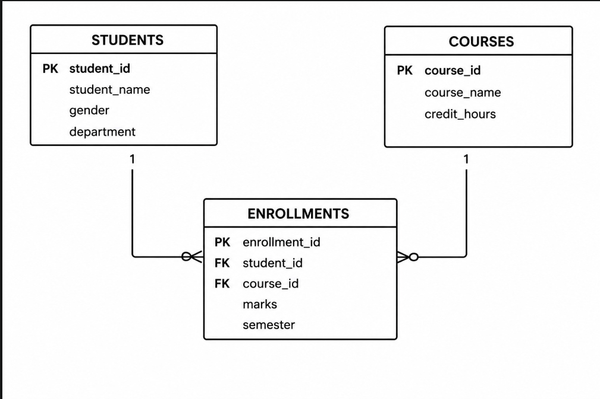

# Student Information System

## Business Problem

Many universities need an efficient way to manage student records, courses, and enrollments. Manual record management is time-consuming and may lead to errors. This project develops a Student Information System database that stores student information, course details, and enrollment records. It also uses SQL Common Table Expressions (CTEs) and Window Functions to generate analytical reports and support better academic decision-making.

## Database Schema

The database consists of three related tables:

### Students
- student_id (Primary Key)
- student_name
- gender
- department

### Courses
- course_id (Primary Key)
- course_name
- credit_hours

### Enrollments
- enrollment_id (Primary Key)
- student_id (Foreign Key)
- course_id (Foreign Key)
- marks
- semester

## ER Diagram

The ER diagram shows the relationship between the three tables: Students, Courses, and Enrollments.

- One student can have many enrollments.
- One course can have many enrollments.
- The Enrollments table connects Students and Courses using foreign keys.

## CTE Implementations

1. Simple CTE – Retrieves students with marks greater than or equal to 80.
2. Multiple CTEs – Calculates average marks using multiple CTEs.
3. Recursive Query – Generates sequential values using Oracle hierarchical query.
4. CTE with Aggregation – Calculates average, minimum, and maximum marks for each course.
5. CTE with JOIN – Combines Students, Courses, and Enrollments.

## Window Function Implementations

- ROW_NUMBER()
- RANK()
- DENSE_RANK()
- PERCENT_RANK()
- SUM() OVER()
- AVG() OVER()
- MIN() OVER()
- MAX() OVER()
- LAG()
- LEAD()
- NTILE()
- CUME_DIST()

## Analysis and Findings

The project demonstrates how SQL CTEs and Window Functions can simplify complex queries and generate analytical reports. These techniques help analyze student performance efficiently.

## References

- Oracle Database SQL Language Reference
- Oracle Database Documentation
- Database Programming Course Materials

## Academic Integrity Statement

I declare that this assignment is my own original work and complies with the university's academic integrity policy.
